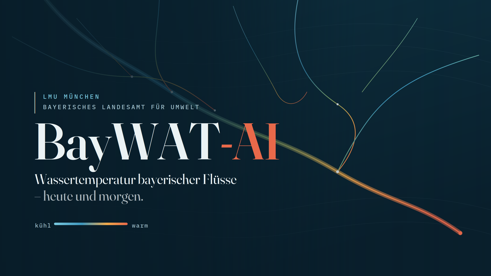

## BayWaT-AI starting Oct 2026

::: {.highlight-box}
{fig-alt="BayWaT-AI project cover" style="max-width: 100%; border-radius: 6px;"}

**River water temperatures and riverine heatwaves in Bavaria.** Deep-learning
models (LSTM-based) to predict stream water temperatures and detect riverine
heatwave events under climate change, building on hydrological and
meteorological data across Bavarian catchments.
:::

## Climate and Statistic

*since 2024*

A comprehension of machine learning and statistical methods in climate
modelling. Supervising a collaborative student project in a seminar at LMU.

## Towards Algorithm-Agnostic Interpretability in Clustering

*2022/23*

Master thesis in Interpretable Machine Learning — transfer and extension of
implementation methods to clustering tasks. See the
[publication](publications.qmd) and the CRAN package
[FACT](https://cran.r-project.org/package=FACT).

## Fuzzy DBScan

*2022*

An R CRAN package for fuzzy clustering with DBScan.

## Automated classification of atmospheric circulation patterns using deep learning methods

*2021*

Development of a Python package using PyTorch; publication and presentation
at the EnviroInfo conference. 1st place at bidt Innovation Laboratories.

## The No-U-Turn Sampler with dual averaging

*2021*

Seminar project on Bayesian inference.
